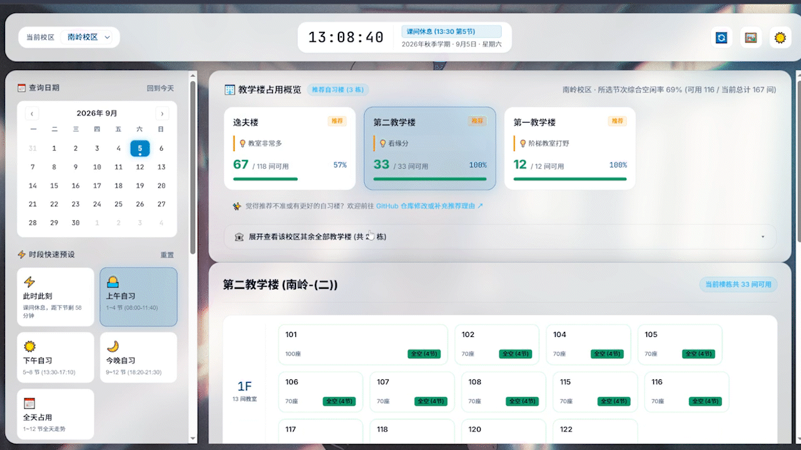
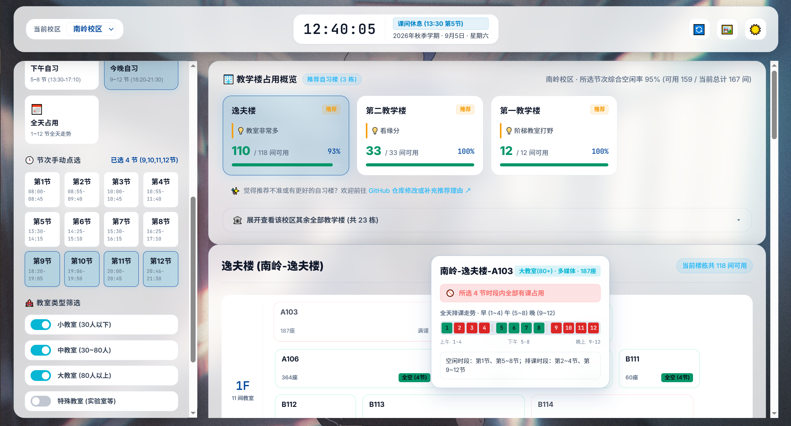
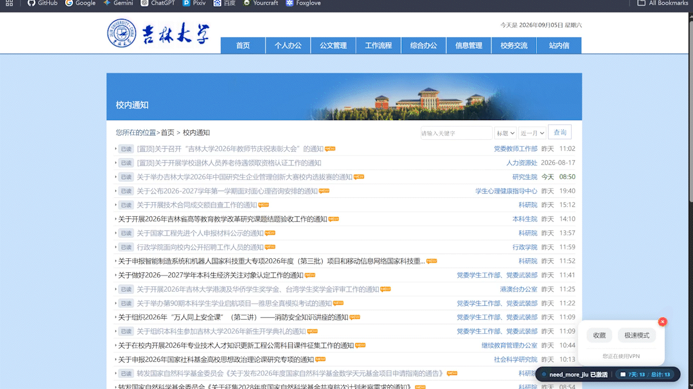
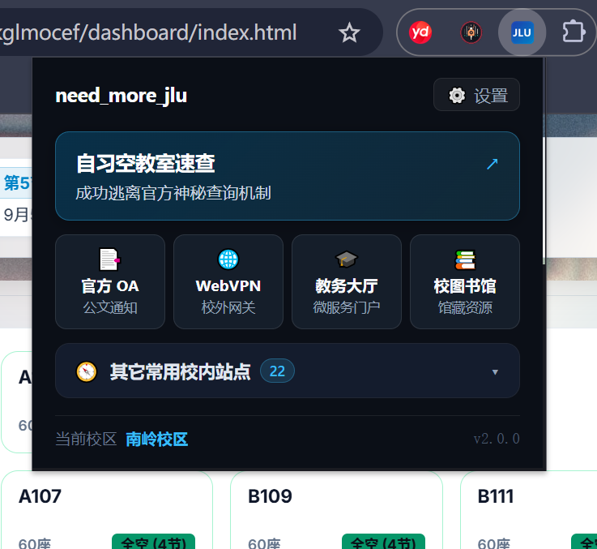

# need_more_jlu - 吉大工具箱 - 校园网实用增强

> 更适合吉大学生体质的吉大官网增强 Chrome / Edge 扩展程序（Manifest V3 架构）

[](https://microsoftedge.microsoft.com/addons/detail/need_more_jlu-jlu-campu/cjgdpenommkljoeiebahakjpgcmdlmmn)
[](LICENSE)
[](https://developer.chrome.com/docs/extensions/mv3/intro/)
[](PRIVACY.md)
[](CONTRIBUTING.md)

### 🚀 官方商店已上架（推荐一键安装）：
👉 **[need_more_jlu - JLU Campus Utility Toolkit - Microsoft Edge Addons](https://microsoftedge.microsoft.com/addons/detail/need_more_jlu-jlu-campu/cjgdpenommkljoeiebahakjpgcmdlmmn)**

---

## 笑话一则

学校官网老旧的好处：

1. 没人会看
2. 接口万年不变，方便自定义插件/爬虫
3. 有千禧年怀旧感
4. 没人关心你会对官网干什么
5. 没有现代元素的情况下加载仍然慢于现代 UI

*以下内容主要使用AI生成*


---

## 🌟 效果展示与核心功能

### 1. 现代空教室速查仪表盘 (`/dashboard`)
彻底告别教务系统古早复杂的表单，实现微观空间直觉与自习安全感选座。





* **微观楼层座舱图**：楼层（1F、2F...）矩阵展示真实教室舱位，实时标记全空（🟢）、中途有课（🟡）、满课（🔴）与封闭机房（⚪）。
* **悬浮全天切片**：鼠标悬浮即时显示 1~12 节课表时间轴与建议停留时长。
* **场景一键切换**：“此时此刻立刻有座”、“上午自习 (1-4节)”、“下午自习 (5-8节)”、“今晚自习 (9-12节)”及任意节次多选。
* **全校六大校区 128 栋楼覆盖**：完整收录前卫、南岭、新民、朝阳、南湖、和平全部教学楼与实验中心。
* **校园网直连 / WebVPN 双通道**：校内网络秒开直连，校外自动接入 WebVPN 加密通道。

---

### 2. 官方 OA 极简增强 (`/content`)
告别公文列表频繁打开新标签页与迷路，原网页无损嵌入。



* **原网页保真侧边抽屉**：点击公文标题从右侧滑出阅读抽屉，100% 还原官方排版与印章；支持 `Esc` 键秒退与左边缘自由拖拽宽度。
* **阅读历史轨迹**：右下角悬浮药丸实时记录查阅总数，展开直达近 7 天浏览轨迹，支持自动过期清理。

---

### 3. 快捷控制面板与常用站点导航 (`/popup`)
浏览器右上角常驻入口，聚合高频校园办事入口。



* **高频卡片直达**：自习仪表盘、官方 OA、WebVPN 统一门户、教务办事大厅、校图书馆一键直通。
* **校内站点展开目录**：折叠面板收录 22+ 个吉大常用平台（选课、邮箱、网络缴费、正版软件、DeepSeek 等），支持关键词实时模糊搜索。

---

## 🛠️ 安装与使用

### 方式一：官方扩展商店一键安装（推荐，自动更新）

本项目已正式上架微软官方扩展商店，支持一键安装并自动静默更新：

👉 **[Microsoft Edge Add-ons 官方商店下载安装](https://microsoftedge.microsoft.com/addons/detail/need_more_jlu-jlu-campu/cjgdpenommkljoeiebahakjpgcmdlmmn)**

> 💡 **提示**：
> * **Edge 浏览器**：访问上述链接后，点击右上角 **「获取」** 即可一键安装。
> * **Chrome 浏览器**：Chrome 同样支持直接安装 Edge 扩展。打开链接后若顶部提示权限，点击「允许来自其他应用商店的扩展」，随后点击「添加至 Chrome」即可一键安装。

---

### 方式二：开发者模式手动加载（源码/离线安装）

如果你想使用未发布的最新开发版或自行修改代码，请按以下步骤手动加载：

1. **下载项目**：点击本页面右上角绿色的 **`Code`** 按钮，选择 **`Download ZIP`**，下载后解压到本地电脑（例如解压到桌面）。
2. **打开扩展管理页**：
   * **Chrome 浏览器**：在地址栏输入并回车：`chrome://extensions/`
   * **Edge 浏览器**：在地址栏输入并回车：`edge://extensions/`
3. **开启开发者模式**：打开页面中的 **「开发者模式」** 开关（Chrome 在右上角，Edge 在左下角）。
4. **加载插件**：点击 **「加载已解压的扩展程序」**，选中解压出的 `need_more_jlu` 文件夹即可。
5. **固定图标**：点击浏览器右上角的拼图图标（扩展程序），找到 `need_more_jlu` 并点击图钉固定在工具栏，方便随时点击。

---

## 🤝 参与贡献

欢迎通过提交推荐自习楼栋、校正教室数据、反馈使用体验等方式帮助全校同学！  
推荐使用 AI / 个人 Agent（如 GitHub Copilot、Claude、ChatGPT）结对协同开发。

👉 完整指引请查看：**[参与贡献指南 (CONTRIBUTING.md)](CONTRIBUTING.md)**

---

## 🐛 反馈与提问

如果你在使用中遇到了 Bug、闪退、数据拉取失败，或者有新功能想法，欢迎提出 Issue。

### 如何提交一个高效的 Issue？

1. 点击仓库顶部的 [**Issues 标签页**](https://github.com/Shy-up/need-more-jlu/issues)，点击右上角绿色 **`New issue`** 按钮；
2. **标题简明扼要**，例如：`[Bug] 南岭校区逸夫楼在校园网下无法加载数据`；
3. **内容请尽量包含以下关键信息**（直接复制填空即可）：

```markdown
- **所在校区**：南岭 / 前卫 / 新民 / 朝阳 / 南湖 / 和平
- **网络环境**：校园网直连 (JLU.PC / JLU.WLAN) / WebVPN / 外部宽带
- **浏览器类型与版本**：Chrome 120+ / Edge / 其他
- **问题描述**：点击查询后提示什么，或者出现了什么不符合预期的情况
- **截图（非常重要）**：
  - 界面出错截图
  - 按键盘 `F12` 打开控制台（Console），若有红字报错请截图一并附上
```

## 📂 项目目录架构

```text
need_more_jlu/
├── manifest.json              # Chrome Manifest V3 清单
├── LICENSE                    # MIT 开源授权文件
├── config/
│   └── constants.js           # 网络超时、WebVPN Hash 路由与作息表
├── data/
│   ├── campuses.json          # 全校 6 大校区 128 栋楼数据
│   └── recommendations.json   # 推荐楼栋与体验评价（欢迎贡献）
├── dashboard/                 # 自习空教室直达仪表盘（纯原生 ESM）
│   ├── index.html
│   ├── dashboard.css
│   ├── css/                   # 模块化样式（座舱图、悬浮卡、壁纸）
│   └── js/                    # 切片重构引擎、双通道拉取与渲染控制器
├── content/                   # 官方 OA 页面保真抽屉与历史统计
├── background/                # 双通道探活与跨域数据代理 Worker
├── popup/                     # 右上角控制面板与常用站点导航
└── readme_assets/             # README 演示动图与高清截图
```

---

## 🧪 真实环境可用性实测

扩展已在长春移动 WebVPN 及南岭校区实测通过。各校区实测状态矩阵与反馈指引请参阅：  
👉 **[可用性实测进度与反馈 (TESTING.md)](TESTING.md)**

---

## 📄 开源协议与隐私政策

* **开源授权**：本项目采用 **[MIT License](LICENSE)** 协议开源。任何人均可自由使用、学习、修改与分发。
* **隐私声明**：本项目遵循端到端隐私保护，详见 **[隐私政策 (Privacy Policy)](PRIVACY.md)**。

---

## 声明

1. **非官方隶属声明**：
   本项目（`need_more_jlu`）为吉大学生个人基于开源共享精神独立开发的公益学习辅助工具，**非吉林大学（JLU）官方发布，亦不代表吉林大学官方立场或观点**。项目中提及的学校名称、相关教务系统及官方网站版权均归吉林大学及相关方所有。本项目仅在本地浏览器端协助合法已认证学生便捷查阅空教室与浏览公文，绝无篡改、不正当窃取教务数据，亦不留存任何用户的统一身份认证账号及密码。

2. **素材合规声明**：
   本项目界面中所使用的加载指示动图（`assets/loading.gif`）与交互图标均为无版权/开源合规素材。
