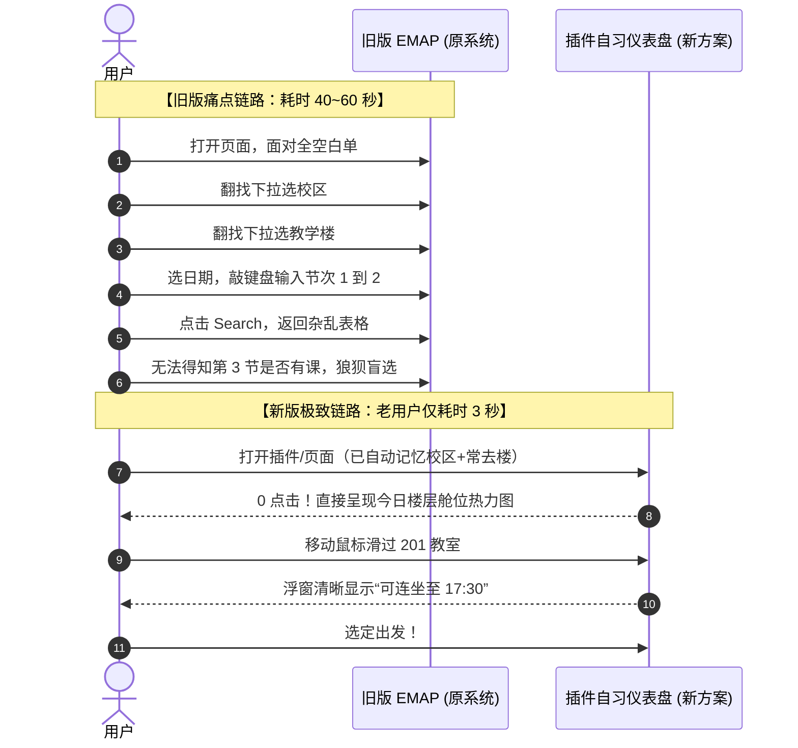

# 吉林大学空闲教室查询系统（kxjas）现状调研、学生痛点剖析与现代化仪表盘方案

> **调研对象**：吉林大学教务一体化服务平台 - 空闲教室查询系统（kxjas）  
> **访问路径**：`https://vpn.jlu.edu.cn/.../jwapp/sys/kxjas/*default/index.do?THEME=purple&EMAP_LANG=en#/kxjscx`  
> **调研目的**：响应受访学生对“自习地点/空闲教室查询系统落后”的核心关切，全面解剖旧版交互缺陷，结合产品设想沉淀下一阶段自习仪表盘规划。

---

## 一、 现有系统实测全貌与基本特征

经实际进入吉林大学 WebVPN 环境加载金智 EMAP 教学平台进行多维度检索测试，该系统的基本运转形态如下：


### 1. 典型界面形态
* **架构底座**：基于金智教育（Wisedu）EMAP 框架与 `jqGrid` 衍生表格，外层包裹吉大 WebVPN 动态加解密网关。
* **双 Tab 分流**：
  * **按日期查询**：学校校区、教学楼、教室类型、空闲日期、空闲节次（两格数字步进器）、上课座位数、考试座位数；
  * **按周次查询**：学年学期、学校校区、教学楼、教室类型、空闲周次、空闲星期、空闲节次、座位数等。
* **返回数据字段**：学校校区、教学楼、教室类型、教室代码、教室名称、楼层、空闲周次、空闲节次、空闲星期、是否允许排课、是否允许考试、是否允许借用。

---

## 二、 学生真实使用痛点深度剖析

结合实地操作抓包测试与学生日常自习场景，现有系统存在五大严重脱节的痛点：

### 痛点 1：教务填表式交互，零智能预设（交互成本极高）
* **无任何默认值**：页面初次加载时，所有筛选项均显示为白板（`Please Choose...`）。
* **忽视系统时间感知**：系统明明可感知“当前是第几学期、第几周、星期几、现在几点几分对应哪一节课”，却强迫学生每次像填报税单一样从零选择。
* **校区/楼栋层级冗长**：吉大六校区七校园，下拉菜单动辄几十项，缺乏“常驻校区/收藏楼宇”记忆。
* **反人类的节次输入**：采用 `[ 1 ] - [ 2 ]` 两个数字微调框，必须点箭头或键盘敲击。现实中学生思维是“下午后两节”或“晚自习”，而非换算节次数字区间。
* **操作成本**：学生仅仅想知道“逸夫楼现在哪有座”，需完成 **8~12 次精准点击和输入**。

### 痛点 2：时间切片离散割裂，缺乏“连续空闲（连坐安全感）”【最致命痛点】
* **“被赶狗式自习”的心理阴影**：
  * 系统仅支持查询某个离散节次（如 1-2 节）空的教室。
  * 学生在系统看到某教室 1-2 节空闲，收拾书包前往入座；
  * 刚进入学习状态到第 3 节（10:00），突然大批师生进门上课，学生只得狼狈收拾书包离开重新找教室。
* **根源在于缺乏全天时间轴（Timeline / Matrix）**：
  * 系统只提供符合单次条件的平铺行，**不提供该教室整天的课表占用走势**。
  * 学生的真正诉求不是“当前 45 分钟谁空”，而是**“这间教室我能安心连坐多久”**（连坐指数）。

### 痛点 3：信噪比极低，充斥大量“伪可用”场地与行政冗余字段
* **充斥无法自习的“封闭场地”**：
  * 查询结果默认将大量学生根本无法进入的场地混排在最前列，例如：`数学基地实验室108`、`数学实验中心实验室215`、`机房`、`音乐厅`、`天元中心多功能室`。
  * 此类房间大多日常上锁、门禁受限、专人专管或专供实验，学生满怀希望爬上楼才发现铁将军把门。
* **行政字段无意义挤占空间**：
  * 表格堂而皇之展示「教室代码」、「是否允许排课」、「是否允许考试」、「是否允许借用」等教务处排考人员关心的字段，对找自习的学生毫无价值，徒增视觉噪音。

### 痛点 4：学生关键决策物理维度彻底缺失
在学生实际决策过程中，以下条件权重极高，但系统**全部缺失**：
1. **电源插座便利性**：笔记本/iPad 学习党的生命线；
2. **桌椅舒适度与类型**：固定连排窄长木板桌椅 vs 平地独立宽敞课桌；
3. **温控与采光**：夏季空调/风扇、冬季供暖状况、大窗采光；
4. **楼层爬楼成本**：未标明是否有电梯，爬 5-6 楼的盲盒风险。

### 痛点 5：移动端体验归零与 WebVPN 性能损耗
* **PC 宽屏思维局限**：底层采用横向长达 11 列的固宽表格，手机端访问需要双手来回划动，表头经常横向错位。
* **慢速加解密白屏**：WebVPN 网关拦截结合 EMAP 庞大 JS Bundle，学生在路上或教学楼走廊用手机网络查询时，经常经历 5~15 秒漫长加载。

---

## 三、 新一代“自习直达仪表盘”方案规划

针对上述痛点，结合用户设想（`request.txt`），彻底颠覆“填表查数据库”的旧逻辑，重构为**空间映射、一眼通透、零点击直达的现代化自习仪表盘**。

```mermaid
flowchart TB
    subgraph 顶层控制 [1. 校区与智能筛选控制器]
        Campus[校区记忆: 默认选中常驻校区]
        QuickPresets[快捷时段预设: 今晚自习 | 今天下午 | 此时此刻 | 连坐4节+]
        CustomSlots[节次多选点阵: 1~12 节直观勾选]
    end

    subgraph 宏观看板 [2. 楼宇占用概览看板]
        B1[李四光楼: 78% 空闲]
        B2[逸夫楼: 42% 空闲]
        B3[外语楼: 15% 紧张]
    end

    subgraph 空间矩阵 [3. 收藏教学楼: 类似电影院/飞机座位的微观楼层舱位图]
        direction TB
        F3["3F [301 🟢] [302 🟡] [305 🔴] [机房 ⚪]"]
        F2["2F [201 🟢] [202 🟢] [208 🟡] [阶教 🟢]"]
        F1["1F [101 🔴] [102 🟢] [107 🟢] [报告厅 ⚪]"]
    end

    subgraph 微观悬浮 [4. 鼠标悬浮 / 移动端轻触 Tooltip]
        HoverCard["【201 阶梯教室 · 150座】\n全天走势: 🟢🟢🟢🟢 | 🔴🔴 | 🟢🟢🟢🟢\n状态: 当前空闲，可连坐至 17:30 (下节无课)\n设施: 靠墙有插座 · 有空调"]
    end

    Campus --> QuickPresets --> B1 & B2 & B3
    B2 -. 展开详细 .-> F3 & F2 & F1
    F2 -. 悬浮聚焦 .-> HoverCard
```

### 1. 从外向内的四层设计哲学

#### ① 第一层：校区与个人常驻设置（带持久化记忆）
* **极简逻辑**：一名学生一周甚至一学期切换校区的次数屈指可数。
* **设计**：初次选择后自动永久记忆（如“南岭校区”），再次打开时 0 步进入对应校区，免除反复下拉。

#### ② 第二层：全校/常用教学楼宏观占用看板
* **进度条与数字直观呈现**：以卡片形式罗列校区内各教学楼；
* **关键指标**：`空闲节数·房间 / 总节数·房间` 及颜色进度环（绿：大量空闲，黄：中等适中，红：几乎占满）；
* 方便学生在跨楼选择时，一眼看出“逸夫楼空座多，还是李四光楼空座多”。

#### ③ 第三层：收藏教学楼的“微观楼层选座舱位图”【核心创新】
* **空间映射直觉**：
  * 按真实建筑结构分楼层（1F、2F、3F...）垂直排列；
  * 无法准确识别楼层的房间统一归入“其他空间”收纳。
* **教室格子视觉系统（类似电影选座/飞机座位图）**：
  * **状态色即时映射**：
    * 🟢 **全空（安全）**：所选/当前时段全程无课，安心长坐；
    * 🟡 **部分空（警惕）**：当前空闲但中途/下节有课排入；
    * 🔴 **全占（忙碌）**：所选时段已被排满；
    * ⚪ **灰度/特殊标记**：实验室、机房、非教学封闭空间（可一键隐藏）。
  * **格子形态**：阶梯大教室尺寸较大并带有图标，普通小教室尺寸紧凑，快速建立空间认知。

#### ④ 第四层：悬浮/轻触卡片（1~12 节全天占用时间轴）
* **免点击获取全量情报**：鼠标划过格子（或移动端轻按）立即浮出卡片：
  * **1~12 节迷你热力条（Mini-Timeline）**：一眼看到全天各节次是绿是红；
  * **智能连坐提示**：“**当前空闲，可连续自习至 17:30（连续 4 节无课）**”；
  * **教室规格**：座位数、类型、推荐自习指数。

---

### 2. 智能筛选控制器（有记忆、高响应、带预设）

* **直观节次勾选点阵**：告别反人类数字微调框，采用 1~12 节快捷胶囊按钮，支持多选。
* **常用情景预设（One-Click Presets）**：
  * ⚡ **此时此刻立刻有座**：自动匹配当前时间对应的节次与后续节次；
  * ☀️ **今天下午（5~8节）**；
  * 🌙 **今晚自习（9~11节）**；
  * ⏳ **长坐无忧（连续 ≥ 4 节空闲）**；
  * 📅 **自定义日期与时段（支持自定义保存并记住状态）**。
* **联动反应**：调整筛选器瞬间，下方所有楼栋、楼层及教室格子的颜色与连坐状态秒级响应重算。

---

## 四、 新老用户使用链路对照



---

## 五、 技术实施与数据流规划

1. **接口复用可行性**：
   * 原系统 `jwapp/sys/kxjas` 后台具备标准的 JSON API，可通过携带已有 WebVPN Cookie 直接异步 fetch 批量教室课表占用。
2. **端侧聚合与离线缓存**：
   * 教学楼一周的课表占用数据属于静态/准静态数据，变更频率低（通常仅调课时微调）；
   * 插件端完全可在用户首次加载后将其缓存于 `chrome.storage.local`，实现**秒开直出**，摆脱 WebVPN 网络延迟。
3. **分阶段落地步骤**：
   * **Phase 1（轻量渐进增强）**：针对当前访问的 `kxjas` 网页注入覆盖层，自动填充当前校区/时间/周次，并在原生表格旁绘制“连续空闲指示器”与机房过滤开关；
   * **Phase 2（独立仪表盘卡片）**：在插件 Popup 或全屏扩展页中，完整构建上述“微观楼层舱位图 + 宏观楼栋占用看板”，提供极致流畅的现代自习选座体验。
