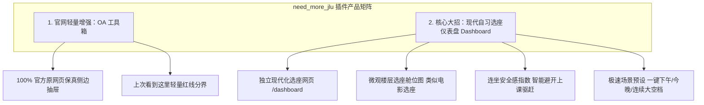

# 吉林大学校园网增强插件（need_more_jlu）用户访谈记录与复盘

* **访谈时间**：2026-09-04 13:20 ~ 13:50
* **受访者画像**：吉林大学大二本科生，南岭校区（工科代表）
* **使用场景**：极低频、突发奇想/校园传闻求证导向，日常基本不主动逛 OA
* **记录状态**：已完成整理并形成产品重构决策

---

## 一、 用户核心观点与原话摘录

| 探讨维度 | 受访者核心原话 | 背后深层心理与场景 |
| :--- | :--- | :--- |
| **整体评价与频次** | “不定期，基本突发奇想/需要了解学校传闻时才看。现在也是，感觉没什么区别。” | 访问属于纯事件驱动型（群里听说放假/政策变动才来看），使用极低频，对纯视觉美化无感。 |
| **UI 重构与信息流** | “是新UI，我换了壁纸后颜值不错，但说实话本身信息流质量就差，改UI感觉帮助不大。” | 视觉包装无法解决行政信息杂乱、与工科生强相关内容稀疏的客观事实，“精致的无用信息”依然无用。 |
| **搜索与操作习惯** | “原来：开官网，Ctrl+F；现在：开插件，Ctrl+F，感觉差不多。” | 用户拥有强大的既有肌肉记忆，强加新交互不能替代用户对全局简单检索的习惯。 |
| **抽屉式阅读与安全感** | “只有不用强制跳转(侧边浏览)还行，但显示的也不是原文(排版等等都对不上，这部分如果是官网原文更让人安心点)。” | 抽屉秒开避免 WebVPN 慢加载受认可；但清洗排版破坏了红头、印章、表格的权威感，引发**“信息是否被篡改/遗漏”**的焦虑。 |
| **智能分类与算法信任** | “我不太信任第三方算法：多推荐了还好，但就变回去了，少推荐了不就白花精力了吗？如此官网全量似乎更让人安心。” | **学业信息漏报（False Negative）代价不可承受**（如推免、选课、处分、奖学金），用户坚决拒绝黑盒过滤，要求**全量透明呈现**。 |
| **侧边栏实现方案建议** | “建议侧边栏用原网页显示（去掉顶侧栏和侧边栏等也行），这样最不用担心‘我的信息被篡改了’。” | 期望 100% 原始 DOM / iframe 真实展现，既享受侧边快速阅读，又彻底放心。 |
| **插件定位终极总结** | “我认为OA美化非常鸡肋，你们完全可以只保留一个侧边打开的功能（顶多加一个'12小时前最后一次打开时更新到哪'的分界线），最小化修改，只是‘多了一两个实用功能的官网’，而非为了一两个实用功能‘去新网站’，这样最令人安心。” | **产品设计核心哲学**：做渐进增强插件，不做替代性新网站。克制、可靠、最小修改。 |
| **校内高频痛点延伸** | “自习地点（空闲教室查询）查询系统有点落后（使用频率相对稳定和高），吉大邮箱官网更古董(但其实基本没人用)。” | 挖掘出南岭乃至全校本科生的稳定高频刚需——**空闲教室/自习室查询**。 |

---

## 二、 核心认知纠偏与产品设计哲学

### 1. “好插件” vs “新网站”
* **误区**：以为把老旧网站改造成全新的流体卡片流、添加精美壁纸毛玻璃就是好产品。
* **真相**：用户来高校官网的核心诉求是**办事、求证、追求确定性**。过度重构不仅剥夺了熟悉感，还让用户感觉“进了一个不可信的第三方山寨网页”。
* **法则**：**渐进增强（Augment, Don't Rebuild）**——在原版基础上只多提供一两项真正实用的微创新。

### 2. 算法信任鸿沟（防漏报心理）
* 高校公文通知涉及保研学分、重修退课、资助评优等切身利益，漏报惩罚极其惨重。
* 任何自动隐藏、打标、分类都带有“黑盒”不可控风险。必须坚持**全量公开、零漏项**。

### 3. 公文权威感与真实还原
* 原版网页的红头公文样式、居中排版表格、盖章落款具有严肃法律效力。
* 侧边栏预览必须保持**原文原貌（零篡改渲染）**，杜绝过度清洗带来的失真感。

---

## 三、 `need_more_jlu` 产品重构实施规划

依据本次访谈结论，插件整体架构将实施**“大刀阔斧做减法、极致聚焦做加法”**的重塑：

```mermaid
flowchart TD
    A[need_more_jlu 插件] --> B[重构前: 激进全量重铸 (自嗨)]
    A --> C[重构后: 极简克制渐进增强 (好插件)]

    B -. 废弃 / 隐藏 .-> B1[卡片流覆盖原始 DOM]
    B -. 废弃 / 隐藏 .-> B2[第三方不可靠分类 Tab]
    B -. 废弃 / 隐藏 .-> B3[未读呼吸灯与复杂配置]
    B -. 废弃 / 隐藏 .-> B4[清洗式富文本抽屉]

    C ==> C1[1. 原生保真侧边抽屉: iframe/原网页秒开，无篡改]
    C ==> C2[2. 上次看到这里: 原生表格内嵌时间分界线]
    C ==> C3[3. 尊重原生习惯: 保留原版表格，Ctrl+点击新标签]
```

### 1. 计划减法（剔除鸡肋包装）
- [ ] 停止强制隐藏原生表格与替换 `#nmj-root` 卡片流；
- [ ] 废弃激进的分类算法 Tab，避免用户产生漏掉通知的担忧；
- [ ] 简化设置项与壁纸依赖，恢复极速轻量加载。

### 2. 计划加法（两大核心功能）
- [ ] **功能 1：原网页保真侧边抽屉（零篡改）**
  - 在原版表格行点击时直接滑出侧边栏；
  - 侧边栏内嵌原网页（仅用样式隐藏原网页顶栏 200px 巨幅横幅与冗余外壳），保持文章正文、表格、附件 100% 原始真实；
  - 允许按 `Esc` 或点击遮罩即刻关闭；原生保留 `Ctrl + 点击` 或右键新开标签页。
- [ ] **功能 2：「上次看到这里」轻量分界线**
  - 自动记录用户上次访问该页面的顶栏第一条通知 ID 与时间戳；
  - 在原版表格中插入一条醒目简洁的隔离行：
    `———————— 🚩 上次查看（8小时前 / 昨天 16:30）看到这里 ————————`
  - 用户向下扫至此线即可确认所有最新通知已尽览，零认知心智负担。

---

## 四、 第二轮终极访谈（正式开发前定调）

* **访谈时间**：2026-09-04 14:40
* **核心定调与原话**：
  > “模块1：如果是完全在官网的情况下（没有任何自建网站），只是官网多了这两个功能，那还是有一定帮助的（可以视作工具箱中的小功能，而非核心功能）。”  
  > “模块2：你的问题太长了，不想看( 但是完全支持做成单独的网页，学校原来的网站反人类，而且数据筛选的部分相对高可信点(全部白纸黑字条件筛选过滤，不像OA需要主观判断)。这部分希望你们给我试试demo再问。千万别做成官网那个逆天样子了。”

* **受访者核心诉求与产品决策提炼**：
  1. **OA 模块回归工具箱定位**：彻底放弃主页重构，仅作为官方 OA 页面内部注入的轻量微增强（极简抽屉 + 进度分界红线），不抢占主舞台，零侵入、零心理负担。
  2. **空闲教室独立成页（Dashboard）获全力支持**：
     - **数据信任本质不同**：OA 通知带有主观和时效不确定性（学生反感算法黑盒）；而空闲教室是“白纸黑字”的教务客观排课数据，学生**高度支持且信任强力条件筛选与现代化可视化**。
     - **形态确认**：确定做成**独立的现代化 Web 仪表盘（Dashboard）**，不再委身于旧系统逼仄臃肿的框架内。
     - **交付原则**：拒绝冗长纸面询问，**以可交互 Demo 为唯一检验标准**，彻底告别旧版反人类填表与宽屏呆板表格。

---

## 五、 最终开发实施路线（封板）



1. **第一优先级**：快速构建出**自习仪表盘交互 Demo**，直接送至受访学生手中试用验证；
2. **第二优先级**：精简重构 `inject.js` 与 `drawer.js`，实现官方 OA 极简工具箱。

